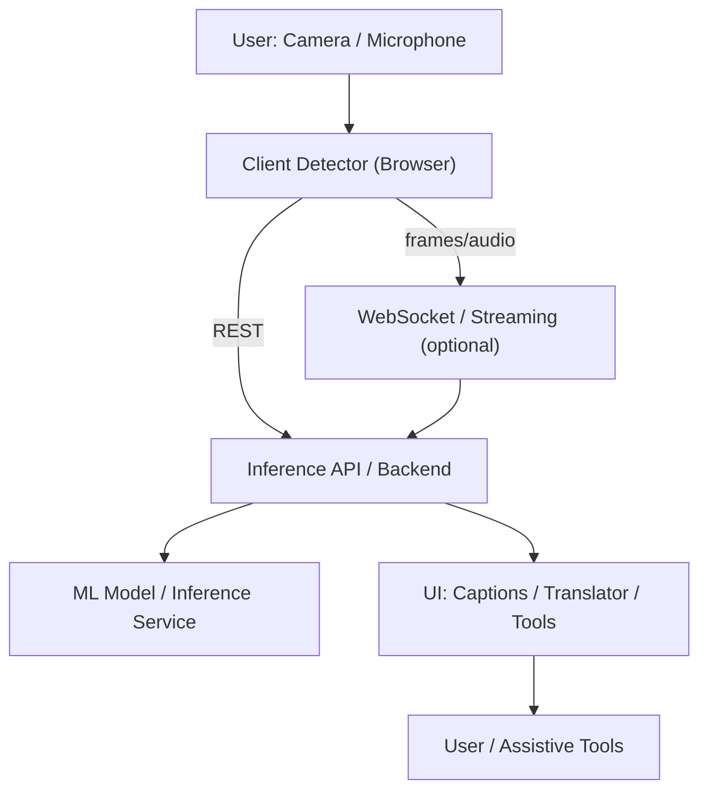
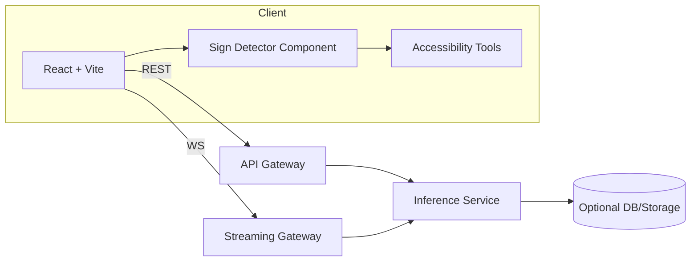

<!--
  New comprehensive README for the Sign Language demo.
  Includes inline Mermaid diagrams and references to simple SVG infographics
  placed in `public/images/`.
-->

# Assistive Sign Language — Demo & Project Overview

Demo: https://assited.netlify.app/

Welcome — this website the demo version of the Assistive Sign Language app: its purpose, architecture, usage, tech stack, APIs and realtime integrations, and visual infographics. The README intentionally includes both Mermaid diagrams (for quick edit/view) and SVG placeholders (in `public/images/`) that you can replace with designed assets.

**Quick Links**
- Demo: `https://assited.netlify.app/`
- Live infographics: `/images/infographic-flow.svg` and `/images/architecture-map.svg`

**Goals of this Demo**
- Demonstrate real-time sign-language detection and translation.
- Showcase accessibility-first assistive tools: captioning, TTS, STT, voice commands, and text simplification.
- Provide a production-like UI for stakeholder review and integration testing.

**Who this is for & Problem Statement**

- **Primary users**: Deaf and hard-of-hearing people who need real-time access to spoken content and an easier way to communicate with non-signing people.
- **Secondary users**: Educators, interpreters, caregivers, and content creators who want to make learning materials accessible and provide sign-language explanations alongside text/audio.
- **Developers & Integrators**: Teams building accessible products who need a demo-ready front-end and integration patterns for REST/WS-based inference services.

Problem this project addresses:

- Communication gap: spoken and written content is often inaccessible to sign-language users; this project offers realtime translation and captions to bridge that gap.
- Accessibility in learning: many educational resources lack built-in sign-language support or live captioning; this demo shows how to integrate those features into learning platforms.
- Latency & usability: traditional captioning can lag or miss context; streaming + partial results (WebSockets) reduce perceived latency and improve UX.
- Privacy vs accuracy: developers often must choose between local (on-device) inference for privacy and server-side inference for accuracy/performance — this project demonstrates both approaches and how to switch between them.

Use cases:

- Live lectures or webinars that need instant captions and sign translations.
- Online learning platforms that want to add sign-language guides and accessible UI controls.
- Prototype and evaluation of ML models for sign recognition in research or product teams.


**Core Features**
- Camera-based sign detection and translation
- Real-time speech-to-text and live captions
- Text-to-speech and voice command interaction
- Accessibility preferences (contrast, font-size, simplified UI)
- Extensible architecture allowing REST or WebSocket ML backends

**Infographics (static assets)**
- Flow infographic (PNG/SVG): `/images/infographic-flow.svg`
- Architecture map (PNG/SVG): `/images/architecture-map.svg`

If you prefer Mermaid diagrams, there are editable snippets below.

---

**Process Flow (Mermaid)** — paste into a Mermaid renderer or use the SVG above:



**Architecture (Mermaid)**:



---

**Tech Stack**
- Frontend: `React` (TypeScript) + `Vite`
- UI: `Tailwind CSS`, custom theme in `tailwind.config.ts`
- Realtime: WebSocket for streaming frames/partial results
- APIs: REST endpoints for inference + optional streaming API
- ML Options: on-device (WASM/WebNN) or server-side inference (Python/TF/PyTorch)
- Tooling: `npm`/`pnpm`/`bun`, `ESLint`, TypeScript

**APIs & WebSocket Integration**
- REST Inference: call `POST /api/infer` with image/frame or feature payload.
- Streaming: connect to `wss://...` for low-latency frame/partial transcription streaming.
- Typical REST payloads:

```http
POST /api/infer
Content-Type: application/json

{
  "type": "frame",          # or "audio"
  "payload": "<base64-frame>"
}
```

WebSocket events are JSON messages for start/partial/final results and control events.

Security: use a bearer token or signed URL in production for both REST and WS.

**What’s in the Repo (high level)**
- `src/components/` — UI, `SignLanguageDetector.tsx`, `SignLanguageTranslator.tsx`, `AdvancedSignLanguageDetector.tsx`
- `src/components/tools/` — `SpeechToText.tsx`, `TextToSpeech.tsx`, `LiveCaptioning.tsx`, `TextSimplifier.tsx`, `VoiceCommands.tsx`, `AccessibilitySettings.tsx`
- `src/components/ui/` — primitive components used throughout app
- `src/hooks/` — `use-mobile.tsx`, `use-toast.ts`
- `src/lib/` — shared utilities
- `src/pages/` — `Demo.tsx`, `SignLanguagePage.tsx`, `AssistiveTools.tsx`
- `public/images/` — static infographics (the two SVG placeholders added alongside this README)

**Color Palette & Accessibility**

Ensure WCAG contrast compliance for text overlays—tweak colors in `tailwind.config.ts` if needed.
**Color Palette & Accessibility**

- Primary: `#7C3AED` (indigo-violet)
- Accent: `#06B6D4` (teal)
- Success: `#10B981` (green)
- Danger: `#EF4444` (red)
- Background: `#0F172A` (dark) / `#FFFFFF` (light mode)

Ensure WCAG contrast compliance for text overlays—tweak colors in `tailwind.config.ts` if needed.

**Color Swatches**

Below are quick visual swatches you can use for UI reference. These are small inline boxes with hex codes — keep them here as a quick style guide. If your renderer strips inline styles, the hex codes are provided next to each swatch.

<div style="display:flex;gap:12px;flex-wrap:wrap;margin-top:8px;margin-bottom:12px">
  <div style="width:160px;padding:10px;border-radius:8px;background:#7C3AED;color:#ffffff;text-align:center;font-weight:700">Primary<br/><small style="font-weight:600">#7C3AED</small></div>
  <div style="width:160px;padding:10px;border-radius:8px;background:#06B6D4;color:#031024;text-align:center;font-weight:700">Accent<br/><small style="font-weight:600">#06B6D4</small></div>
  <div style="width:160px;padding:10px;border-radius:8px;background:#10B981;color:#031024;text-align:center;font-weight:700">Success<br/><small style="font-weight:600">#10B981</small></div>
  <div style="width:160px;padding:10px;border-radius:8px;background:#EF4444;color:#ffffff;text-align:center;font-weight:700">Danger<br/><small style="font-weight:600">#EF4444</small></div>
  <div style="width:160px;padding:10px;border-radius:8px;background:#0F172A;color:#ffffff;text-align:center;font-weight:700">Dark BG<br/><small style="font-weight:600">#0F172A</small></div>
  <div style="width:160px;padding:10px;border-radius:8px;background:#FFFFFF;color:#031024;text-align:center;font-weight:700;border:1px solid #e5e7eb">Light BG<br/><small style="font-weight:600">#FFFFFF</small></div>
</div>

Fallback (plain list):

- Primary: `#7C3AED`
- Accent: `#06B6D4`
- Success: `#10B981`
- Danger: `#EF4444`
- Dark background: `#0F172A`
- Light background: `#FFFFFF`

---

**Run Locally**
1. Install dependencies (choose one):

```powershell
npm install
# or
pnpm install
# or (if you use bun)
bun install
```

2. Start dev server:

```powershell
npm run dev
# or
pnpm dev
# or
bun run dev
```

3. Open the URL Vite prints (usually `http://localhost:5173`).

**Environment variables (example)**
Add a `.env` in project root with Vite-style variables:

```text
VITE_API_URL=https://api.example.com
VITE_WS_URL=wss://stream.example.com
```

**Adding or Replacing Infographics**
- Replace `public/images/infographic-flow.svg` and `public/images/architecture-map.svg` with designed assets.
- You can also export higher-res PNGs and reference them from README or pages.

---

**Usage Notes & Best Practices**
- For privacy-sensitive usages, prefer on-device inference (WASM) to avoid sending raw frames.
- Use partial-results via WebSocket to improve perceived latency for captions.
- Provide clear UI controls to pause streaming and to opt-out of camera sharing.

**Contributing**
- Fork, branch, implement changes, and open a PR.
- Add tests for new logic and run the dev server locally to verify UX.

---

`SIGN_LANGUAGE_README.md` updated to include visual assets and developer-focused instructions.

